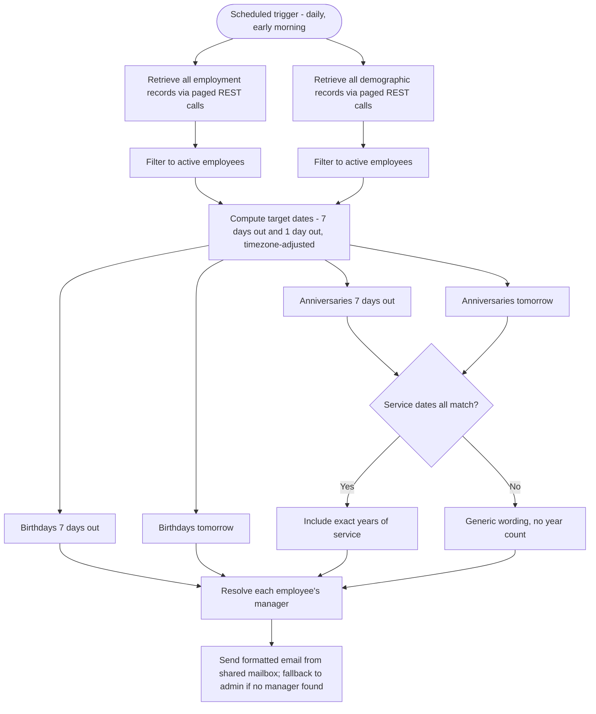

# Automated Birthday & Work Anniversary Notifications

A scheduled Microsoft Power Automate cloud flow that reads employee data from an enterprise HRIS, identifies upcoming birthdays and work anniversaries, and emails each employee's direct manager a timely, formatted reminder — fully automated, with no servers to maintain.

> Sanitized portfolio version. Credentials, internal identifiers, and personal data have been removed; only the logic and structure remain.

## What it does

Every morning the flow pulls the full employee roster from the HR system's REST API, narrows it to active employees, and finds anyone whose birthday or work anniversary falls exactly seven days out or one day out. For each match it looks up the person's direct manager and sends a styled HTML email from a shared "celebrations" mailbox — a heads-up a week ahead to allow time to plan, and a short reminder the day before. Birthdays and anniversaries each get both notifications, for four notification types in total.

## Skills demonstrated

- REST API integration with a paged data source — authentication, pagination, JSON parsing
- Data transformation and filtering entirely within a low-code platform
- Date math and timezone handling
- Relational lookups — joining employees to managers across two datasets
- Conditional business logic and templated HTML email generation
- Designing a cloud-only, license-light, serverless automation

## Architecture

## How it works

1. **Scheduled trigger.** A recurrence trigger runs the flow once daily, early in the morning, in a fixed timezone.

2. **Data retrieval.** Two REST endpoints are called — one for employment data (status, hire dates, reporting line) and one for demographic data (names, birth date, email). Each returns 100 records per page, so a loop pages through until a short page signals the end, accumulating the full roster.

3. **Active-employee filtering.** Both datasets are reduced to active employees and aligned on a shared employee identifier.

4. **Target-date calculation.** The flow computes two reference dates — seven days from today and one day from today — formatted as month-day and adjusted to the business timezone, so the comparison is always correct regardless of when the run executes.

5. **Event matching.** Four filters compare each employee's birth date or hire date against the target dates, producing four sets: birthdays a week out, birthdays tomorrow, anniversaries a week out, anniversaries tomorrow.

6. **Manager resolution.** For each matched employee, a lookup joins their supervisor identifier back to the demographic dataset to find the manager's name and email. If no active manager resolves, the message falls back to an administrator instead of failing.

7. **Anniversary integrity check.** Before stating a number of years, the flow verifies that an employee's several service-date fields all agree. When they do, the email includes the exact years of service; when they don't — for example, after a break in service — it uses warmer generic wording with no specific number, avoiding a figure that might misrepresent someone's history.

8. **Email delivery.** Each notification is a templated, Outlook-safe HTML email sent from a shared mailbox and addressed to the manager.

## Notable design decisions

- **Timezone-safe dates.** Because the platform evaluates time in UTC, all date math is explicitly converted to the business timezone, so a run never matches the wrong calendar day.
- **Pagination by short-page detection.** Rather than hard-coding a page count, the loop stops when a page returns fewer than the page size — resilient to a growing headcount.
- **Graceful manager fallback.** A missing or inactive manager routes the message to an administrator instead of erroring, so one data gap never breaks the batch.
- **Tenure integrity over assumption.** The flow refuses to print a years-of-service number unless multiple service-date fields agree, trading a nice-to-have detail for correctness.
- **Email rendering robustness.** Header colors are applied with inline styles rather than the attribute the email editor silently strips, so the formatting survives in Outlook.
- **Serverless and license-light.** Runs entirely as a cloud flow — no virtual machine, desktop agent, or premium RPA required.

## Tech stack

Microsoft Power Automate (cloud flow) · enterprise HRIS REST API · Office 365 / Exchange Online (shared mailbox) · HTML email
