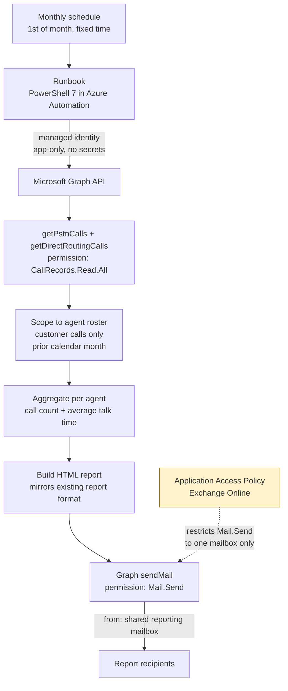

# Automated Monthly Teams Phone Call Reporting

A serverless, scheduled report that captures customer phone calls placed through Microsoft Teams Phone and emails a monthly summary to stakeholders — formatted to mirror the team's existing contact-center report.

## Problem

A team uses a dedicated contact-center platform for customer calls, and its built-in reports drive a monthly per-agent scorecard. But agents also place a meaningful share of customer calls directly through **Microsoft Teams Phone**, outside the contact-center system — and those calls were invisible to the existing reports. The team needed those Teams calls counted too, so agents got credit for the full picture, delivered in the **same format** as the report they already read.

Three constraints shaped the design:

- **Customer calls only** — Teams-to-Teams calls, conference calls, and meetings were explicitly out of scope.
- **A consistent monthly period**, for a fair baseline.
- **No new infrastructure to babysit**, and **no long-lived secrets** to manage.

## Solution

A **PowerShell 7 runbook in Azure Automation**, triggered on a monthly schedule, that:

1. Authenticates to Microsoft Graph **app-only via the Automation account's managed identity** — no secrets or certificates.
2. Pulls the **previous calendar month's PSTN call records** for a defined roster of agents.
3. Aggregates each agent's **call count and average talk time**.
4. Renders an **HTML report mirroring the existing contact-center layout**.
5. Emails it from a shared reporting mailbox to the stakeholders.

Email-sending permission is then **scoped down with an Exchange Online Application Access Policy** so the identity can send only as the one reporting mailbox — least privilege by design.

## Architecture

## How it works

**Schedule.** An Azure Automation schedule fires once a month, a few hours into the 1st so the prior day's call logs have fully settled. The runbook always reports the *previous full calendar month*, computed at runtime, so the exact run day never produces a partial period.

**Authentication.** The runbook connects to Microsoft Graph using the Automation account's **system-assigned managed identity**. The identity is granted two Graph application permissions — `CallRecords.Read.All` and `Mail.Send` — directly, with no app registration, client secret, or certificate to store or rotate.

**Data retrieval.** Customer phone activity is pulled from Graph's `getPstnCalls` (Calling Plan / Operator Connect) and `getDirectRoutingCalls` (Direct Routing) functions for the reporting window, then filtered to the agent roster. Because these are PSTN-specific functions, internal Teams-to-Teams calls never appear — the "customer calls only" scope is satisfied by the data source itself, with conference legs filtered out by call type.

**Aggregation.** For each agent the runbook computes a call count and an average talk time. The grand-total average is weighted across all calls (total talk time ÷ total calls), matching how the existing report calculates it.

**Reporting.** The results are rendered as an HTML table that mirrors the existing contact-center report — same columns, ordering, and totals row — using inline styles so it renders correctly in Outlook.

**Delivery.** The report is sent via Graph `sendMail` from a shared reporting mailbox to the stakeholders.

**Least-privilege lockdown.** `Mail.Send` as an application permission is broad by default — it would allow sending as any mailbox in the tenant. An **Application Access Policy** in Exchange Online restricts the identity so it can send **only** as the single reporting mailbox. The restriction is verified, not assumed: `Test-ApplicationAccessPolicy` returns *Granted* for the reporting mailbox and *Denied* for any other.

## Key design decisions

**PSTN call logs over the full call-records API.** Microsoft Graph's richer call-records API can surface every Teams call and meeting, but it's retained for only ~30 days and would have required a standing capture process to assemble a full calendar month. The PSTN-specific logs are available for ~90 days, which makes a clean, single-run **monthly calendar report** possible — and they map exactly to the in-scope "customer calls." Matching the scope to the simplest sufficient data source removed an entire class of infrastructure.

**Managed identity over an app registration + secret.** Using the Automation account's managed identity eliminates the most common failure and security liability in scheduled automation — an expiring or leaked secret or certificate. There is nothing to rotate and nothing to store.

**Scoped `Mail.Send` instead of broad `Mail.Send`.** Rather than leave the identity able to send as anyone, an Application Access Policy fences it to a single mailbox, so a bug or compromise can't be used to impersonate other users — and the restriction is testable.

**Output mirrors the existing report.** Reusing the format stakeholders already read removed any learning curve and let the new data slot straight into their existing process.

## Tech stack

- **Azure Automation** — PowerShell 7 runbook, system-assigned managed identity, monthly schedule
- **Microsoft Graph** — `getPstnCalls`, `getDirectRoutingCalls`, `sendMail`; application permissions `CallRecords.Read.All`, `Mail.Send`
- **Exchange Online** — Application Access Policy (mail-enabled security group scope) for least-privilege send
- **HTML email** with inline styling for Outlook rendering

---

*All identifiers, addresses, and organization details in this write-up are generic placeholders.*
